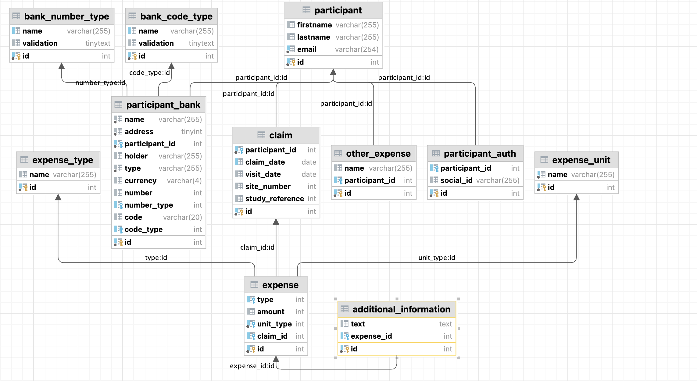
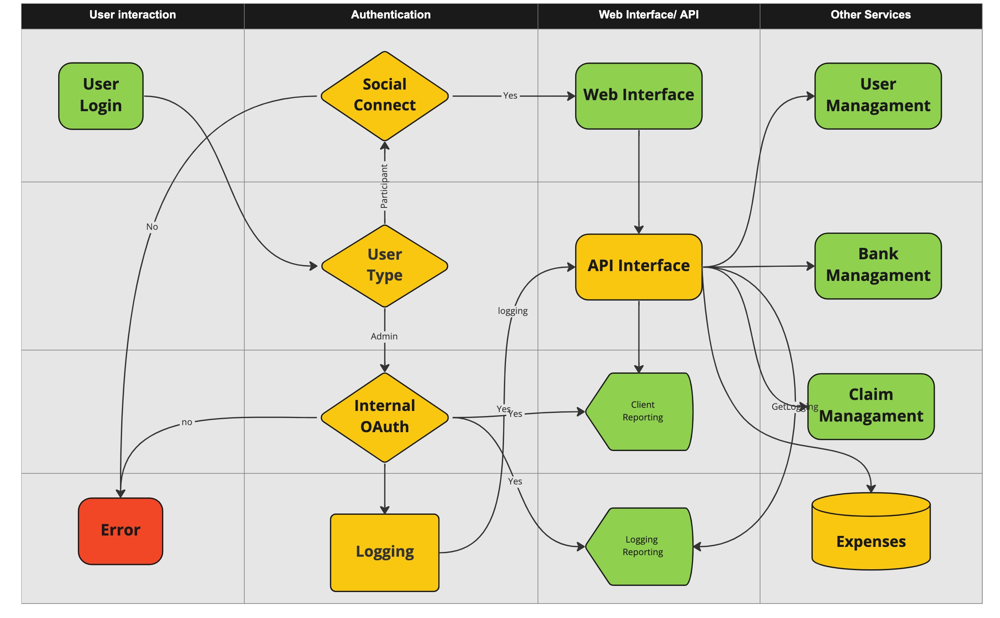

# Slim 4 Expenses API

## Introduction
A Hypothetical microservice based on a participant expense form.    
## Entity Relationship Diagram

## User WorkFlow

## Requirements

* PHP 8.1+
* MySQL 5.7+ or MariaDB

## Features

This project is based on following practices and industry standards:
* HTTP router (Slim)
* HTTP message interfaces (PSR-7)
* HTTP Server Request Handlers, Middleware (PSR-15)
* Dependency injection container (PSR-11)
* Autoloader (PSR-4)
* Logger (PSR-3)
* Code styles (PSR-12)
* Single action controllers
* Input validation
* Query Builder
* Immutable date time ([Chronos](https://github.com/cakephp/chronos))
* Unit- and integration tests

## ADR(s)
* [Record Architecture Decisions](doc/adr/0001-record-architecture-decisions.md)
* [Use Slim4 Framework](doc/adr/0002-uses-slim4.md)
* [Use ADR Design Pattern](doc/adr/0003-use-adr-design-pattern.md)
* [Use Social Connect For Authentication](doc/adr/0004-use-social-connect.md)

## License

The MIT License (MIT). Please see [License File](LICENSE) for more information.
